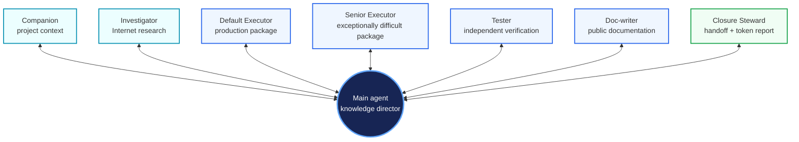

# codex_workflow — Workflow Usage Guide

> This is the maintained user-facing overview. The lifecycle guides and
> installed CLI are authoritative for exact commands and safety behavior.

`codex_workflow` combines three selectable routes, persistent project
documentation, a shared user-level runtime, and conservative lifecycle
operations. Medium and Heavy define roles, ownership, and fixed limits; the
main agent designs the actual orchestration for each task.

## Part 1 — Commands and everyday use

### First-time bootstrap

Open Codex from the project directory and send:

```text
Use the approved private `codex_workflow-1.1.13-private.1.zip` and matching
`SHA256SUMS` built from a clean checkout of the reviewed, pushed private commit.
Verify the checksum, extract the ZIP, then read the bundled
`codex_workflow/bootstrap.md` and follow it exactly.
```

The universal private ZIP supports Linux, macOS, and Windows and requires
Python 3.11 or newer. The bundled lifecycle CLI validates, installs, backs up,
and rolls back its own files. Restart Codex after installation so the new
user-level instructions and worker definitions are loaded.

Bootstrap installs the user runtime and current project, adds marked workflow
rules for generated private assets to `.gitignore`, and invokes one `doc-writer`
action to initialize new or still-template-marked `agent_docs/` files.
`agent_docs/` itself stays trackable. Installation is complete only after that
action succeeds. Existing healthy project documentation is preserved.

### Exact command prompts

Send each command as its own prompt.

#### `codex_workflow --personal`

Interactively updates the current project's Frontend Project Profile, Design
Principles, and Additional Workflow Decisions. Confirmed values live in the
hidden project personalization resource and are materialized only inside the
marked personalization region of the project entry point.

#### `codex_workflow --install`

Installs the already-bootstrapped workflow in the current project. It preserves
project-local instructions, creates missing framework documents, initializes
only new or still-template-marked documentation, and reuses installed
user-level definitions. It does not reinstall the user runtime or reset healthy
project documents.

#### `codex_workflow --update`

Requires an explicit approved, verified private/local package source and applies its
release-owned definitions transactionally. A source-less update fails closed
and never falls back to the public release channel. The update preserves
personalization, project-local instructions, project documents, unrelated Codex
settings, backups, and enabled/disabled state. Obsolete workflow-owned runtime
files and worker roles are removed from the installed manifest.

#### `codex_workflow --check-update`

Reports the installed private version and that public release comparison is
disabled. It does not query, recommend, download, or install a public release,
and changes nothing.

#### `codex_workflow --remove`

Uses a two-phase destructive preview and explicit confirmation. Removal
restores project-local instructions and removes workflow-owned wrappers,
runtime, workers, skills, settings, and hidden resources while preserving
`agent_docs/` and unrelated user content.

#### `codex_workflow --disable` and `codex_workflow --enable`

Disable moves the active entry point to:

```text
AGENTS.md -> .codex_workflow_hidden_resources/.AGENTS.md
```

Enable moves it back. These operations preserve its contents, personalization,
project documents, and the user-level runtime.

### Route selection

- **Light** remains available explicitly. The main agent works alone with
  minimal workflow overhead.
- **Medium** keeps planning, diagnosis, implementation, and verification in the
  main agent. Companion and Investigator provide bounded read-only support.
- **Heavy** is the default and makes production Executors, Tester, and public
  Doc-writer capabilities available to the main agent. Its direct fast path
  still permits zero workers when delegation offers no value.

Select a route in the prompt:

```text
use medium route. [task description]
use heavy route. [task description]
```

The selection lasts for the session unless the user changes it. A question or
small bounded task still takes the direct worker-free fast path and produces no
Deployment Token Report. A substantive Medium or Heavy deployment initializes
or reuses one persistent Companion and receives one automatic Closure Steward
handoff before the final response. Before planning, changing files, or
dispatching workers on the session's first deployment-state entry, the main
agent directly reads the complete current `agent_docs/` framework exactly once,
including module-specific Markdown documents.

## Part 2 — Installed-file map

The release ZIP contains one top-level `codex_workflow/` directory. Repository
presentation files, `.git/`, and development-only release scripts are not
packaged.

```text
~/.codex/
├── AGENTS.md
├── config.toml
├── agents/
│   ├── default_executor.toml
│   ├── senior_executor.toml
│   ├── tester.toml
│   ├── doc-writer.toml
│   ├── companion.toml
│   ├── investigator.toml
│   └── closure_steward.toml
├── skills/
│   └── deployment-token-report/
└── codex_workflow/
    ├── VERSION
    ├── user_AGENTS.md
    ├── workflow.py
    ├── runtime/
    ├── resources/personalization.md
    ├── install_state.json
    ├── heavy_route.md
    ├── medium_route.md
    ├── closure_steward.md
    ├── bootstrap.md
    ├── install.md
    ├── update.md
    ├── check_update.md
    ├── remove.md
    ├── personalization_guide.md
    ├── disable.md
    ├── enable.md
    ├── templates/
    ├── .source_backup/<version>/
    └── .backups/<old-version>-<timestamp>/

<project>/
├── AGENTS.md
├── .gitignore
├── agent_docs/
│   ├── project_overview.md
│   ├── project_core_tech.md
│   ├── project_structure.md
│   ├── project_progress.md
│   ├── project_diary.md
│   └── latest_session_work.md
└── .codex_workflow_hidden_resources/
    ├── personalization.md
    ├── state.json
    └── .AGENTS.md
```

An enabled project has root `AGENTS.md`; a disabled project has the hidden
`.AGENTS.md`. They are mutually exclusive.

The six framework documents have distinct purposes:

- `project_overview.md`: goals, architecture, workflow, major decisions;
- `project_core_tech.md`: important technologies and constraints;
- `project_structure.md`: layout, modules, ownership, and boundaries;
- `project_progress.md`: active goal, current position, and next milestone;
- `project_diary.md`: distilled decisions, discarded approaches, mistakes, and
  reusable lessons—not session chronology;
- `latest_session_work.md`: latest deployment evidence, outcome, pending work,
  and continuation point.

## Part 3 — Fixed definitions and customization

There is no generated workflow settings document. Release-owned behavior lives
in the files that own it:

- worker TOMLs define role, model, permissions, and role boundaries;
- `medium_route.md` and `heavy_route.md` define available capabilities and
  their complete orchestration contracts and static invariants;
- `AGENTS.md` defines shared project rules and route selection;
- `runtime/platform_settings.py` owns the documented Codex platform settings;
- `closure_steward.md` and the Deployment Token Report skill own automatic
  closure and reporting.

The built-in roles are `default_executor`, `senior_executor`, `tester`,
`doc-writer`, `companion`, `investigator`, and `closure_steward`. The default
executor, Companion, Investigator, Tester, Doc-writer, and Closure Steward use
Luna. Senior Executor uses Sol. Heavy permits at most one Senior Executor; the
platform ceiling is twenty active subagents.

Project personalization lives at:

```text
.codex_workflow_hidden_resources/personalization.md
```

Do not put personalization in `agent_docs/` or edit its generated marker
directly. Use `codex_workflow --personal`.

Advanced route or role changes belong in a maintained source package or fork,
because update replaces installed release-owned copies. Preserve role ownership,
the main-centered topology, knowledge distribution to Executors, worker limits,
and single-worker automatic closure unless an intentional architectural change
updates the contracts and tests together.

## Part 4 — Medium and Heavy architecture

### Capability model, not workflow template

Medium and Heavy describe what each role can own and the few constraints that
must always hold. They do not decide in advance whether a real task needs
investigation, how many Executors it needs, whether work should be sequential or
concurrent, which verification strategy fits, or how a failure should be
repaired. The main agent decides those details from the project, task, risk,
and current evidence.

The architecture is hub-and-spoke. Every task worker relates directly to the
main; the diagram expresses available relationships, not an execution order:



The main launches, briefs, waits for, follows up with, integrates, and owns the
lifecycle of every worker directly.

### Roles and source boundaries

| Role | Ownership | Boundary |
| --- | --- | --- |
| Main | Task direction, architecture, topology, scope, material causal decisions, integration, acceptance, final claims, and user communication | Uses worker evidence without surrendering decisions |
| Companion | Persistent read-only context work in the project ecosystem | Repository, project docs, local modules and dependencies, locally available sibling-project material, source, tests, logs, configuration, Git history, and artifacts; no Internet research |
| Investigator | Disposable read-only research for any bounded external-information question on the Internet | Adapts sources and search to the question; no local project ownership, implementation, or final project decision |
| Default Executor | Bounded production discovery, implementation, self-check, and ordinary repair | Only its assigned mutable surface |
| Senior Executor | One exceptionally difficult reasoning or production package | At most one instance; not the default executor |
| Tester | Independent verification and assigned test assets | Designs suitable tests from acceptance intent and risks; no production fixes |
| Doc-writer | Verified public, product, operator, or service documentation | No deployment closure edits in `agent_docs/` |
| Closure Steward | Final `agent_docs/` reconciliation, read-only Git handoff, and token report | No production/public-doc edits and no Git mutations |

Companion and Investigator are separated by information source across all task
types. Companion answers what the project ecosystem contains and how it
behaves. Investigator discovers and synthesizes useful information outside that
ecosystem. The main decides what the combined information means for the
project.

The main uses Investigator when Internet research would materially help and may
ask it any bounded external question. Eligibility follows the information
source and required research capability across task domains.

### Knowledge distribution and verification

Every initial task-worker package begins with a logical **Task ID** that is
unique within the deployment. The remaining capsule reflects the worker's
actual function:

| Role | Capsule parts |
| --- | --- |
| Companion | Project Context Scope; Context Task + Goal; Main-Agent Context Guidance |
| Investigator | Research Context; Research Question + Goal; Main-Agent Research Guidance |
| Default or Senior Executor | Implementation Context + Ownership; Implementation Task + Goal; Main-Agent Implementation Guidance |
| Tester | Verification Context; Verification Goal; Main-Agent Verification Guidance |
| Doc-writer | Documentation Context + Audience; Documentation Task + Goal; Main-Agent Documentation Guidance |

Task ID correlates dispatch, reports, follow-ups, and artifacts; it may match
the platform `task_name` but remains a logical package identifier. Workers echo
it in every report. The named capsule parts are complete and their content stays
proportional to the package. Follow-ups repeat Task ID and send only the changed
role-specific parts.

The capsule standardizes main–worker communication. The main separately owns
role eligibility, topology, worker count, dependencies, sequencing,
concurrency, repair, verification, acceptance, and lifecycle for the task.

This preserves the main agent as knowledge director while moving operational
work and context to lower-cost workers. Executor capsules combine the desired
outcome with the main's task-specific knowledge and guidance.

Tester ownership answers a different question. The main defines acceptance
intent, material risks, scope, contracts, and any truly required gate. The
Tester normally designs the concrete test cases and verification method, runs
them independently, and reports evidence. If it finds a production defect, it
reports the focused failure to the main. The main decides the repair topology
and re-verification path appropriate to that task.

Workers keep large logs and detailed operational context out of main-agent
history and return concise, decision-ready evidence. The main directly checks
material that controls a high-risk decision or final claim, but does not
routinely repeat fresh, credible worker checks.

### Fixed Heavy invariants

Heavy keeps only stable platform, safety, and ownership rules rigid:

- no more than twenty active subagents, including Companion and Closure
  Steward;
- one persistent Companion and at most one Senior Executor;
- initial task workers normally use `fork_turns="none"` and receive an explicit
  brief;
- the main directly owns every worker's lifecycle;
- concurrent mutable packages have non-overlapping ownership;
- Tester does not repair production code and Doc-writer does not infer
  unverified behavior;
- workers preserve unrelated user work and do not mutate Git without authority;
- one fresh Closure Steward closes each substantive deployment.

Within those invariants, main-agent discretion controls worker count, reuse,
dependencies, sequencing, concurrency, investigation, implementation,
verification, repair, evidence representation, deployment, rollback, and
stopping conditions.

Medium has the same Companion/Investigator source boundary and closure model,
but prohibits delegated production Executors, Tester, and ordinary Doc-writer
packages. The main performs implementation and verification itself.

### Cross-session continuity and token reporting

`project_progress.md` stores the active goal and next milestone;
`latest_session_work.md` stores the last deployment outcome, evidence, blockers,
and continuation point. On the first entry to deployment state in a session,
the main directly reads all six core documents and every module-specific
Markdown document under `agent_docs/` exactly once. This one read is shared by
Medium and Heavy. The main does not reopen the framework during later
deployments or route changes; Companion handles bounded delta or conflict checks
when freshness matters.

The first Companion brief for each substantive deployment contains:

```text
codex-workflow-deployment-start: <deployment_id>
```

Before the final response, one fresh Closure Steward inherits recent main-agent
context, reconciles the complete `agent_docs/` framework, performs compact
closing checks, and reports read-only Git state. After sealing its writes, it
invokes `$deployment-token-report` for that deployment ID. The deterministic
parser returns `Agent`, `Quantity`, `Rollouts`, `Cached input`, `Input`, and
`Output`. Closure and reporting are not used on the direct fast path.

The report preserves this exact six-column template:

```text
| Agent | Quantity | Rollouts | Cached input | Input | Output |
| --- | ---: | ---: | ---: | ---: | ---: |
| <agent role> | <count> | <count> | <tokens> | <tokens> | <tokens> |
```

## Part 5 — Component hierarchy and ownership

The system has five logical ownership blocks:

### 1. Shared workflow runtime

`~/.codex/agents/`, `~/.codex/skills/`, and
`~/.codex/codex_workflow/` contain the reusable role definitions, routes,
reporting skill, lifecycle runtime, templates, and backups. They contain no
project-specific decision.

### 2. Project integration

The current project's `AGENTS.md` connects the shared runtime to the project.
`agent_docs/` contains durable project context. The hidden `.AGENTS.md` is the
same entry point in disabled state and cannot coexist with the active root file.

### 3. Fixed release definitions

Worker TOMLs, route documents, `AGENTS.md`, Closure Steward, and documented
platform keys are release-owned. Install and update materialize them exactly;
there is no generated aggregate configuration that can drift from those
sources.

### 4. Project personalization

`.codex_workflow_hidden_resources/personalization.md` contains confirmed
project-scoped preferences. Its marked materialization in the entry point is
effective instruction; it is not ordinary project documentation.

### 5. Lifecycle control

`user_AGENTS.md` exposes the exact commands. `bootstrap.md`, `install.md`,
`update.md`, `check_update.md`, `remove.md`, `personalization_guide.md`,
`disable.md`, and `enable.md` define intent; `workflow.py` and `runtime/`
perform validated deterministic mutations.

These are ownership boundaries rather than disjoint directories:

```text
User level: shared runtime + fixed definitions + lifecycle guidance
                    │
                    │ materialized into the current project
                    ▼
Project level: entry point + durable documents + private personalization
```
